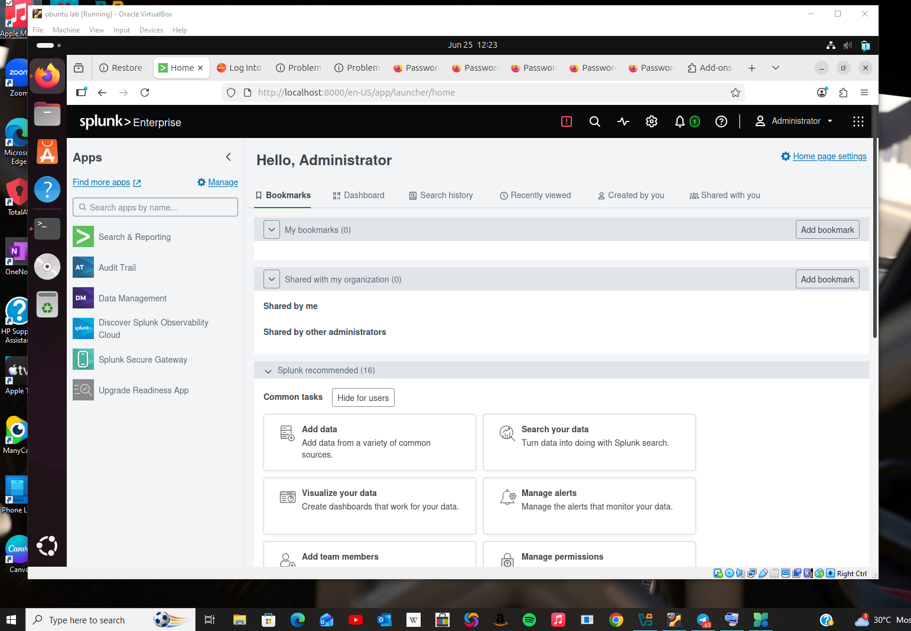
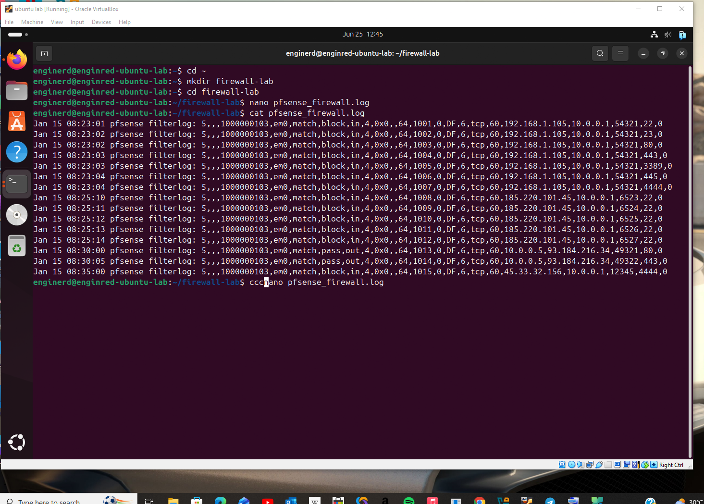
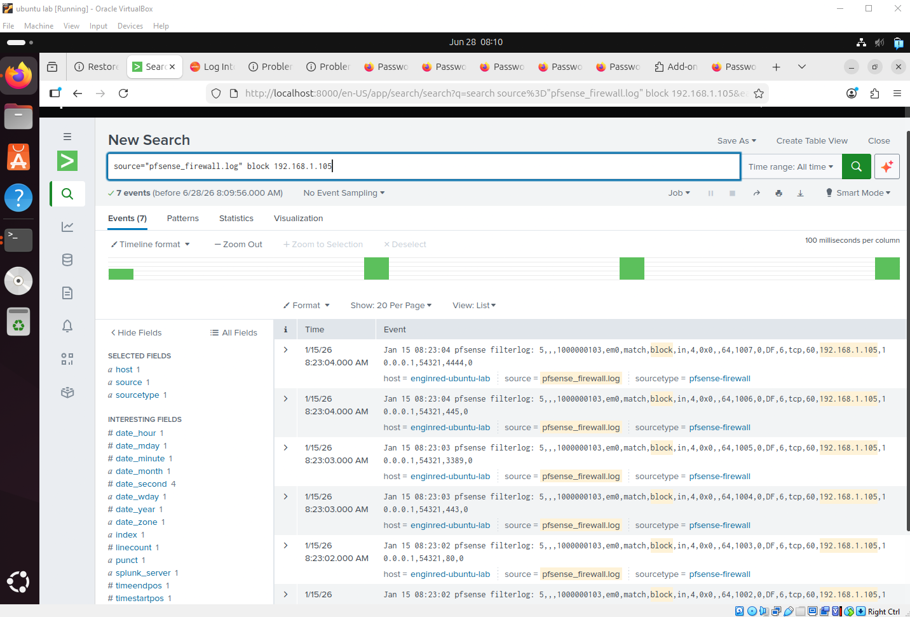
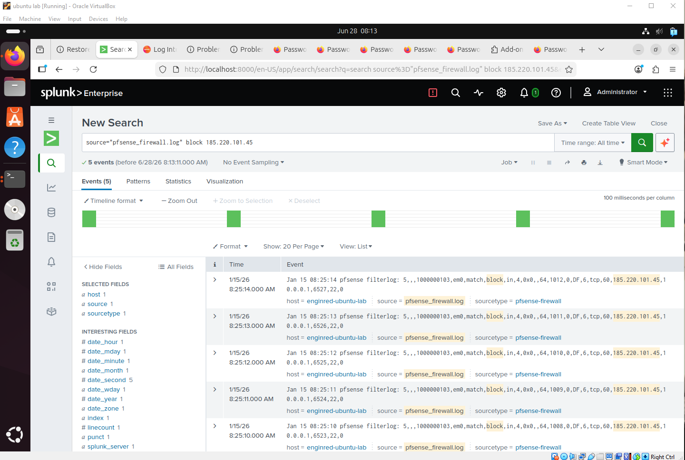
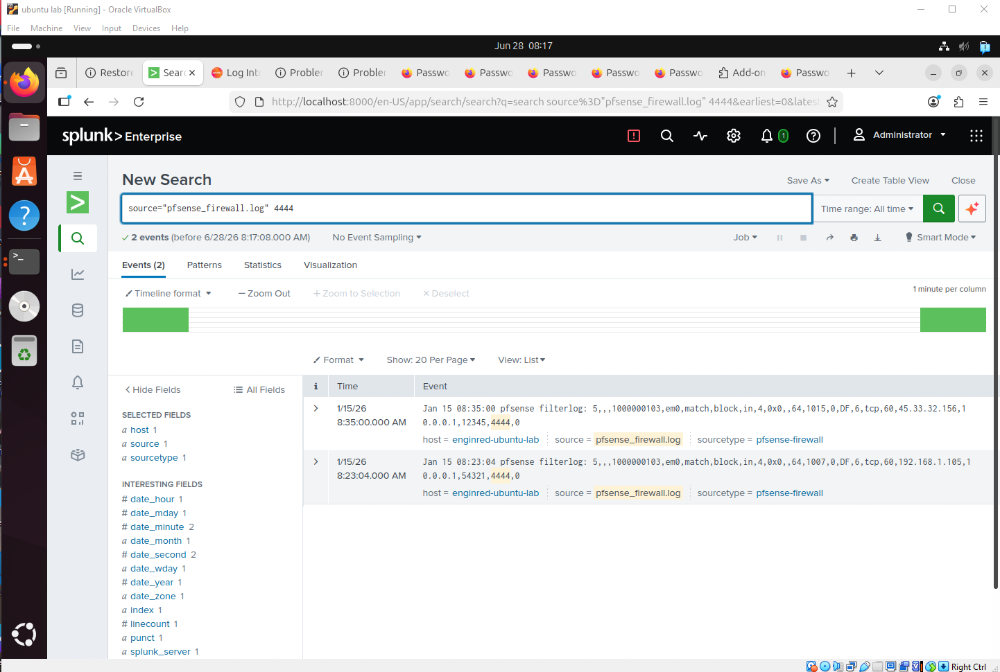
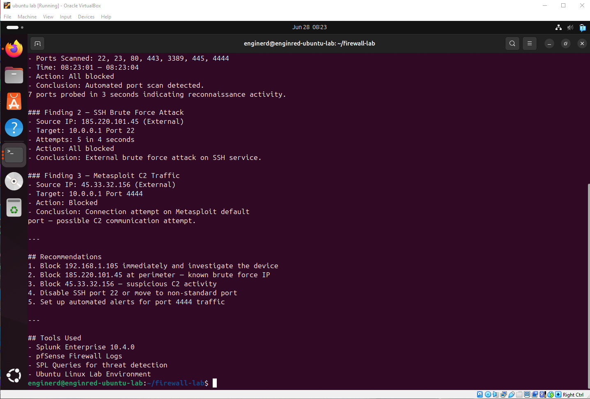

# Firewall Log Analysis & Threat Detection Lab

## Project Overview
Blue Team SOC lab analysing pfSense firewall logs 
using Splunk Enterprise to detect real attack patterns.

## Threats Detected
- Port Scan — 192.168.1.105
- SSH Brute Force — 185.220.101.45  
- Metasploit C2 Traffic — Port 4444

## Tools Used
- Splunk Enterprise 10.4.0
- pfSense Firewall Logs
- SPL Queries
- Ubuntu Linux on VirtualBox

## Skills Demonstrated
- Firewall log ingestion into SIEM
- SPL query writing for threat detection
- Alert triage and incident documentation
- SOC Tier 1 analyst workflow

## Screenshots

### Splunk Dashboard

### Firewall Logs Ingested

### Port Scan Detected

### Brute Force Attack Detected

### Metasploit C2 Traffic Detected

### Incident Report

## Analyst
Raphael Akro | raphsec.github.io
